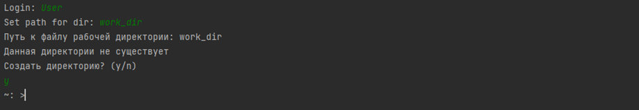
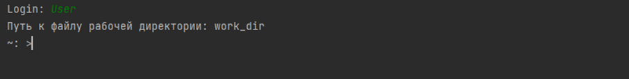
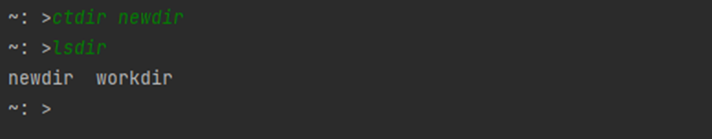
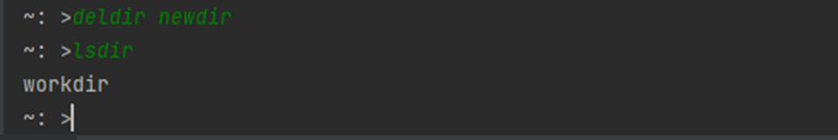
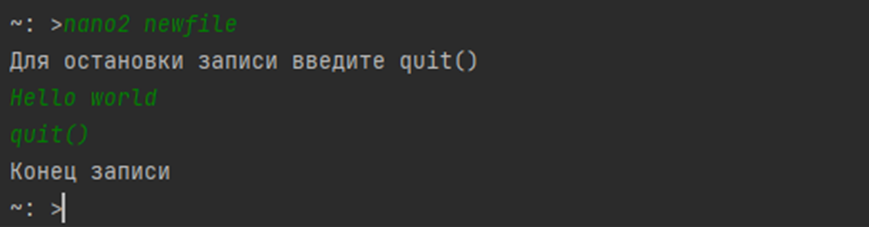
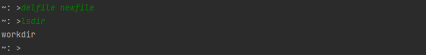
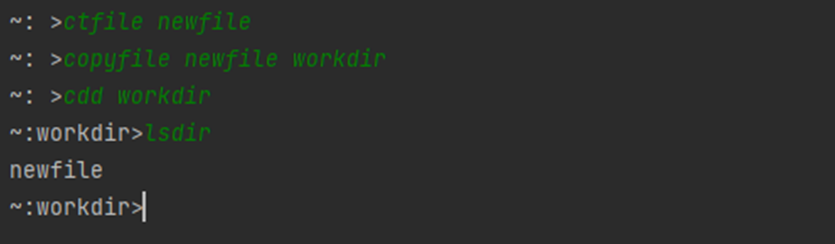
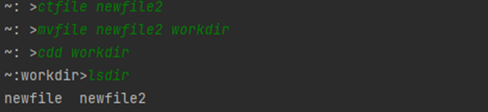

Файловый менеджер
---
main.py - Файловый менеджер\
func - директоря с функциями файлового менеджера\
Setting.txt - файл с пользователями и их рабочими папками

Работа файлового менеджера
---
Содание рабочей папки пользователя

Вход зарегистрированного пользователя

Функции:
1. Создание папки (с указанием имени);

2. Удаление папки по имени;

3. Перемещение между папками (в пределах рабочей папки) - заход в папку по имени, выход на уровень вверх;

4. Создание пустых файлов с указанием имени;

5. Запись текста в файл;

6. Просмотр содержимого текстового файла;

7. Удаление файлов по имени;

8. Копирование файлов из одной папки в другую;

9. Перемещение файлов;

10. Переименование файлов.
